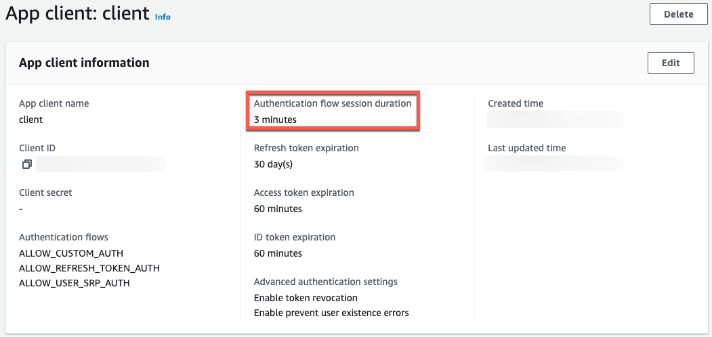

## Introduction

> [!IMPORTANT]
> Cognito user pools now supports email as a mfa option. For more information, please visit the [official announcement page](https://aws.amazon.com/about-aws/whats-new/2024/09/amazon-cognito-user-pools-email-authentication-option/).

Cognito comes with built-in support for the MFA feature, but developers can only choose from either SMS or TOTP options. However, many websites offer an additional email authentication. Developers can implement it using Cognito User Pool [custom authentication challenges](https://docs.aws.amazon.com/cognito/latest/developerguide/user-pool-lambda-challenge.html).

## Requirements

- [Python 3.x](https://www.python.org/downloads/)
- [boto3](https://github.com/boto/boto3)
- [AWS SAM CLI](https://docs.aws.amazon.com/serverless-application-model/latest/developerguide/install-sam-cli.html)
- Amazon Simple Email Service for sending OTP codes

When you run the example script, you need to install the following:

- [warrant](https://github.com/capless/warrant/)
- [cryptography](https://github.com/pyca/cryptography/)
- [python-jose](https://github.com/mpdavis/python-jose/)

## Python Scripts

### Lambda Layer

[src/layers/python/layers/cognito_custom_challenge_helper.py](./src/layers/python/layers/cognito_custom_challenge_helper.py)

It is used to make it easy to handle custom challenge requests and responses.

### Define Auth Challenge

[src/define_auth_challenge/app.py](./src/define_auth_challenge/app.py)

When starting the custom authentication flow, Cognito invokes ["Define Auth challenge Lambda trigger"](https://docs.aws.amazon.com/cognito/latest/developerguide/user-pool-lambda-define-auth-challenge.html).

### Create Auth Challenge

[src/create_auth_challenge/app.py](./src/create_auth_challenge/app.py)

When creating OTP codes which will be sent to users in the authentication challenge flow, Cognito invokes ["Create Auth challenge Lambda trigger"](https://docs.aws.amazon.com/cognito/latest/developerguide/user-pool-lambda-create-auth-challenge.html).

Environment variables [`CODE_LENGTH`](./src/create_auth_challenge/app.py#L12) and [`EMAIL_SENDER`](./src/create_auth_challenge/app.py#L13) in the script are specified by an AWS SAM template described later.

> [!TIP]
> By placing the OTP code issued from the last session into the response metadata, users can reuse the OTP code during the same authentication challenge session.

You can configure authentication flow session duration in Cognito.



### Verify Auth Challenge

[src/verify_auth_challenge/app.py](./src/verify_auth_challenge/app.py)

When verifying OTP codes, Cognito invokes ["Verify Auth challenge Lambda trigger"](https://docs.aws.amazon.com/cognito/latest/developerguide/user-pool-lambda-verify-auth-challenge-response.html).

## Creating AWS Resources

### AWS SAM Template

[template.yaml](template.yaml)

Key Points:

- To enable custom authentication challenges, set [`ALLOW_CUSTOM_AUTH`](./template.yaml#L39) within `ExplicitAuthFlows`.
- Please ensure that `CognitoEvent` within each `AWS::Serverless::Function` is linked to the Lambda functions to serve as Cognito Lambda triggers.
- Setting [`Policies`](./template.yaml#L70-L75) in the `CreateAuthChallenge` function is required for sending emails using Amazon SES.

### Build and Deploy

Replace `<YOUR_SES_EMAIL_SENDER>` with a desired email address as a sender, and build and deploy with the following command.
If you want to change the length of OTP codes, also specify `CodeLength` parameter.

```shell
sam build
sam deploy --parameter-overrides EmailSender=<YOUR_SES_EMAIL_SENDER>
# sam deploy --parameter-overrides EmailSender=<YOUR_SES_EMAIL_SENDER> CodeLength=10
```

When completed, the following AWS resources are created in your AWS environment.

| Logical ID| Type |
| --------- | ---- |
| CognitoUserPool | AWS::Cognito::UserPool |
| CognitoUserPoolClient | AWS::Cognito::UserPoolClient |
| LambdaLayer | AWS::Lambda::LayerVersion |
| CreateAuthChallenge | AWS::Lambda::Function |
| DefineAuthChallenge | AWS::Lambda::Function |
| VerifyAuthChallenge | AWS::Lambda::Function |
| CreateAuthChallengeCognitoPermission | AWS::Lambda::Permission |
| DefineAuthChallengeCognitoPermission | AWS::Lambda::Permission |
| VerifyAuthChallengeCognitoPermission | AWS::Lambda::Permission |
| CreateAuthChallengeRole | AWS::IAM::Role |
| DefineAuthChallengeRole | AWS::IAM::Role |
| VerifyAuthChallengeRole | AWS::IAM::Role |

## Testing

Replace `<YOUR_USER_POOL_ID>` and `<YOUR_EMAIL>` with your values, and create a Cognito testing user with the following command.

```shell
POOL_ID=<YOUR_USER_POOL_ID>
EMAIL=<YOUR_EMAIL>

# Add a Cognito user.
aws cognito-idp admin-create-user \
  --user-pool-id $POOL_ID \
  --username $EMAIL

# Make the user confirmation status "Confirmed"
echo -n 'Password: '
read password
aws cognito-idp admin-set-user-password \
  --user-pool-id $POOL_ID \
  --username $EMAIL \
  --password $password \
  --permanent
```

To test the email MFA, run the following command.

```shell
cd src/example
pip install -r requirements.txt
python main.py \
  --pool-id <YOUR_USER_POOL_ID> \
  --client-id <YOUR_CLIENT_ID> \
  --username <YOUR_EMAIL> \
  --password <YOUR_PASSWORD>
```

The [`src/example/main.py`](./src/example/main.py) uses the following libraries to calculate values needed by [SRP - Secure Remote Password](https://en.wikipedia.org/wiki/Secure_Remote_Password_protocol).

- [Warrant](https://github.com/capless/warrant/)
- [pyca/cryptography](https://github.com/pyca/cryptography/)
- [python-jose](https://github.com/mpdavis/python-jose/)

You may also refer to the AWS official [code example](https://docs.aws.amazon.com/cognito/latest/developerguide/example_cognito-identity-provider_RespondToAuthChallenge_section.html).

## Cleaning Up

Clean up the provisioned AWS resources with the following command.

```shell
sam delete
```

---

## (Optional) Unit Testing

Run the following command in your shell.

```shell
export PYTHONPATH=$PYTHONPATH:$(pwd)/src:$(pwd)/src/layers/python
pytest -vv
```
